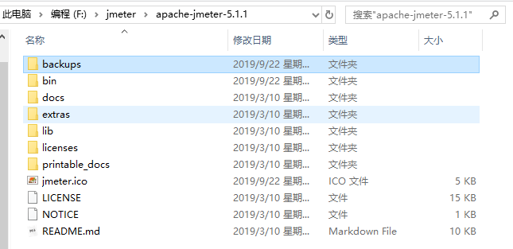
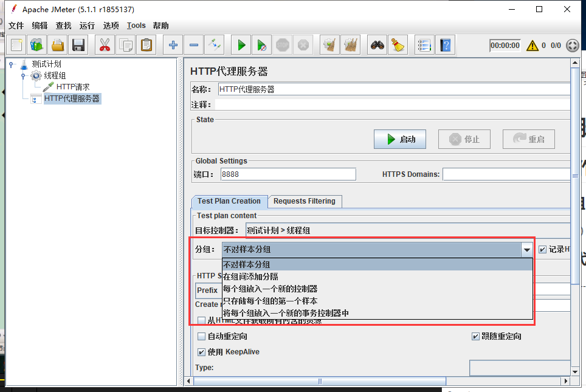

<!-- toc -->
* * [一、jmeter文件目录介绍](#%E4%B8%80jmeter%E6%96%87%E4%BB%B6%E7%9B%AE%E5%BD%95%E4%BB%8B%E7%BB%8D)
  * [1\.bin目录文件](#1bin%E7%9B%AE%E5%BD%95%E6%96%87%E4%BB%B6)
  * [2\.docs接口文档目录](#2docs%E6%8E%A5%E5%8F%A3%E6%96%87%E6%A1%A3%E7%9B%AE%E5%BD%95)
  * [3\.extras扩展插件目录](#3extras%E6%89%A9%E5%B1%95%E6%8F%92%E4%BB%B6%E7%9B%AE%E5%BD%95)
  * [4\.lib](#4lib)
  * [5\.licenses](#5licenses)
  * [6\.printable\_docs](#6printable_docs)
* [二、Jmeter功能概要](#%E4%BA%8Cjmeter%E5%8A%9F%E8%83%BD%E6%A6%82%E8%A6%81)
  * [1\.Jmeter工具组成部分](#1jmeter%E5%B7%A5%E5%85%B7%E7%BB%84%E6%88%90%E9%83%A8%E5%88%86)
  * [2\.线程用户Threads (Users)](#2%E7%BA%BF%E7%A8%8B%E7%94%A8%E6%88%B7threads-users)
    * [1) setup thread group](#1-setup-thread-group)
    * [2）teardown thread group](#2teardown-thread-group)
    * [3）thread group](#3thread-group)
  * [3\.测试片段（Test Fragment）](#3%E6%B5%8B%E8%AF%95%E7%89%87%E6%AE%B5test-fragment)
  * [4\.配置元件（Config Element）](#4%E9%85%8D%E7%BD%AE%E5%85%83%E4%BB%B6config-element)
  * [5\.定时器（Timer）](#5%E5%AE%9A%E6%97%B6%E5%99%A8timer)
  * [6\.前置处理器（Per Processors）](#6%E5%89%8D%E7%BD%AE%E5%A4%84%E7%90%86%E5%99%A8per-processors)
  * [7\.后置处理器（Post Processors）](#7%E5%90%8E%E7%BD%AE%E5%A4%84%E7%90%86%E5%99%A8post-processors)
  * [8\.断言](#8%E6%96%AD%E8%A8%80)
  * [9\.监听器](#9%E7%9B%91%E5%90%AC%E5%99%A8)
  * [10\.取样器](#10%E5%8F%96%E6%A0%B7%E5%99%A8)
  * [11\.逻辑控制器](#11%E9%80%BB%E8%BE%91%E6%8E%A7%E5%88%B6%E5%99%A8)
* [三、Jmeter脚本录制](#%E4%B8%89jmeter%E8%84%9A%E6%9C%AC%E5%BD%95%E5%88%B6)
  * [1\.代理服务器操作步骤](#1%E4%BB%A3%E7%90%86%E6%9C%8D%E5%8A%A1%E5%99%A8%E6%93%8D%E4%BD%9C%E6%AD%A5%E9%AA%A4)
    * [1）创建一个线程组](#1%E5%88%9B%E5%BB%BA%E4%B8%80%E4%B8%AA%E7%BA%BF%E7%A8%8B%E7%BB%84)
    * [2）创建一个http代理服务器](#2%E5%88%9B%E5%BB%BA%E4%B8%80%E4%B8%AAhttp%E4%BB%A3%E7%90%86%E6%9C%8D%E5%8A%A1%E5%99%A8)
      * [①HTTP代理服务器设置\-\-分组详解](#http%E4%BB%A3%E7%90%86%E6%9C%8D%E5%8A%A1%E5%99%A8%E8%AE%BE%E7%BD%AE--%E5%88%86%E7%BB%84%E8%AF%A6%E8%A7%A3)
    * [3）浏览器\-\-internet属性\-\-连接\-局域网设置](#3%E6%B5%8F%E8%A7%88%E5%99%A8--internet%E5%B1%9E%E6%80%A7--%E8%BF%9E%E6%8E%A5-%E5%B1%80%E5%9F%9F%E7%BD%91%E8%AE%BE%E7%BD%AE)
  * [2\.Badboy脚本录制](#2badboy%E8%84%9A%E6%9C%AC%E5%BD%95%E5%88%B6)
* [四、Jmeter元件作用域和执行顺序](#%E5%9B%9Bjmeter%E5%85%83%E4%BB%B6%E4%BD%9C%E7%94%A8%E5%9F%9F%E5%92%8C%E6%89%A7%E8%A1%8C%E9%A1%BA%E5%BA%8F)
  * [1\.元件作用域](#1%E5%85%83%E4%BB%B6%E4%BD%9C%E7%94%A8%E5%9F%9F)
  * [2\.元件执行顺序](#2%E5%85%83%E4%BB%B6%E6%89%A7%E8%A1%8C%E9%A1%BA%E5%BA%8F)
<!-- /toc -->

# 一、jmeter文件目录介绍

## 1.bin目录文件

+ jmeter.bat：windows的启动文件
+ jmeter.log：日志文件
+ jmeter.sh：linux的启动文件
+ jmeter.properties：系统配置文件
+ jmeter-server.bat：windows分布式测试要用到的服务器配置
+ jmeter-service：linux分布式测试要用到的服务器配置

## 2.docs接口文档目录

+ api/index.html：可查看官方文档

## 3.extras扩展插件目录

## 4.lib

所用到的插件目录，里面全是jar包，Jmeter会自动在JMETER_HOME/lib 和ext目录下寻找需要的类

## 5.licenses

jmeter证书目录

## 6.printable_docs

用户使用手册

+ usermanual/index.html

# 二、Jmeter功能概要

## 1.Jmeter工具组成部分

+ 资源生成器：用于生成测试过程中服务器、负载机的资源代码
+ 用户运行器：通常是一个脚本运行引擎，根据脚本要求模拟指定的用户行为
+ 报表生成器：根据测试中实时地数据生成报表，提供可视化的数据显示方式
+ 负载发生器：用于产生负载，通常以多线程或是多线程的方式模拟用户行为

**Test Plan测试计划**：用来描述一个性能测试，包含与本次性能测试所有相关的功能。

## 2.线程用户Threads (Users)

### 1) setup thread group

可用于执行预测试操作。测试前执行定期的线程组

### 2）teardown thread group

可用于执行测试后动作。测试结束后执行定期的线程组

### 3）thread group

我们通常添加运行的线程。可以看做一个虚拟用户组，线程组中的每个线程都可以理解为一个虚拟用户。

## 3.测试片段（Test Fragment）

与线程组不同，当它是一个模块控制器或者是被控制器所引用时才会被执行。

## 4.配置元件（Config Element）

提供对**静态数据**配置的支持。如CSV Data Set config可以将本地数据文件形成数据池（Data Pool）

## 5.定时器（Timer）

用于操作之间设置等待时间，等待时间是性能测试中常用的控制客户端QPS的手段。

## 6.前置处理器（Per Processors）

对实际请求进行前置处理

## 7.后置处理器（Post Processors）

对发出请求后得到的**服务器响应**进行处理。一般用来提取响应中的特定数据。

## 8.断言

检查测试中得到的数据是否符合预期

## 9.监听器

对**测试结果数据**进行处理和可视化展示的元件。查看结果树、聚合报告

## 10.取样器

性能测试中向服务器发送请求，记录响应信息，记录响应时间的最小单元

## 11.逻辑控制器

包含两类元件，一类是控制test plan中sampler节点发送请求的逻辑顺序的控制器，常用的有 if控制器、switch Controller、循环控制器等。另一类是事务控制器、吞吐控制器。

# 三、Jmeter脚本录制

## 1.代理服务器操作步骤

### 1）创建一个线程组

右键测试计划--添加--线程组）

### 2）创建一个http代理服务器

测试计划--添加--非测试元件--http代理服务器

#### ①HTTP代理服务器设置--分组详解

+ 不对样本分组：所有请求全部罗列
+ 在组间添加分隔：加入一个虚拟的以分割线命名的动作
+ 每个组放入一个新的控制器：执行时按控制器输出结果
+ 只存储每个组的第一个样本：保存第一次url请求

设置完后要启动代理服务器，录制完成后记得关闭

### 3）浏览器--internet属性--连接-局域网设置

## 2.Badboy脚本录制

1）提示脚本错误解决

badboy—–Preferences——–Playing—–Javascript Error Dialogs

2）录制完成后导入export to JMeter

3）jmeter中打开jmx文件即可

# 四、Jmeter元件作用域和执行顺序

## 1.元件作用域

+ 取样器：不与其它元件相互作用，不存在作用域问题
+ 逻辑控制器：子节点中取样器和逻辑控制器
+ 其余元件，若是取样器子节点，则对其父子节点起作用。如果父节点不是取样器，则作用域是父节点下其它所有后代节点

## 2.元件执行顺序

1）配置元件

2）前置处理程序

3）定时器

4）取样器

5）后置处理程序

6）断言

7）监听器

# 五、jmeter参数化
+ 前置处理器：用户参数
+ 配置元件：CSV Data Set Config
+ 函数参数化：Tools-函数助手对话框

# 六、Jmeter性能测试实战

## 1.案例1
测试20个用户访问www.xxx.com在负载达到30QPS时的平均响应时间

### 1）添加线程组

线程组主要包含三个参数：线程数、准备时长、循环次数。

+ 线程数：虚拟用户数
+ 准备时长：设置的虚拟用户数需要多长时间全部启动
+ 循环次数：如果线程数为20，循环次数5，那么每个线程总请求数为100

### 2）添加http请求
参数详解
+ 服务器名称或IP：http请求发送的目标ip地址
+ 端口号：目标服务器的端口号，默认值为80
+ Timeouts：设置请求和响应的超时时间
+ 方法：发送http请求的方法GET、POST等
+ Content encoding：内容的编码方式
+ 路径：目标url路径（不包括服务器地址和端口）
+ 自动重定向：当发送http请求后得到的响应是302/301时，Jmeter自动重定向到新的页面
+ Use keep Alive：jmeter和目标服务器之间使用持久连接进行http通信，默认选中
+ Use multipart/from-data for http post:当发送http post请求时，使用Use multipart/from-data方式发送（主要用于post请求体中参数带文件的场景）
+ 同请求一起发送参数：每一行是一个参数对

### 3）设置QPS限制
Jmeter设置常数吞吐量定时器（Constant Throughput Timer），该定时器可以方便的控制取样器发送请求的吞吐量

**Constant Throughput Timer主要属性介绍：**
+ This thread only：每个线程的吞吐量均为目标吞吐量
+ All active threads：目标吞吐量将分配到每个活跃线程上。活跃线程指同一时刻同时运行的线程

### 4）添加监视器
使用监听器元件收集取样器记录的数据，并以可视化方式呈现。
如添加聚合报告、查看结果树

# 七、jmeter集合点与关联
## 1.集合点
定时器：synchronizing Timer

## 2.Jmeter关联
### 1）正则表达式提取器
#### ①引用名称
下一个请求要引用的参数名称，如填写appkey，则可用${appkey}引用它
#### ②正则表达式
+ ()：要提取的内容
+ .：匹配任何字符串
+ +：表示一次或多次
+ ?：找到第一个匹配项后停止
#### ③模板
用$$引用起来,如果正则表达式有多个匹配值，$1$表示解析第一个匹配的值给appkey

#### ④匹配数字
0表示随机取值，1代表全部取值

#### ⑤缺省值
默认值

# 八、后续扩展
1.jmeter自动化性能测试平台搭建
