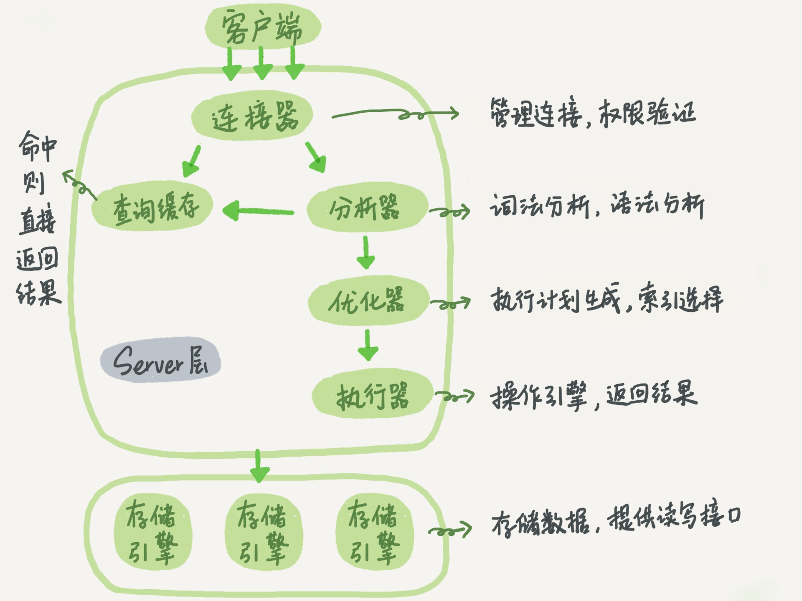

* [一、MySQL基本架构图](#一mysql基本架构图)
         * [1.连接器](#1连接器)
         * [2.查询缓存](#2查询缓存)
         * [3.分析器](#3分析器)
         * [4.优化器](#4优化器)
         * [5.执行器](#5执行器)

## 一、MySQL基本架构图



MySQL可以分为Server层和存储引擎层两部分。不同的存储引擎共用一个Server层，也就是从连接器到执行器部分。

**Server层**

> 包括连接器、查询缓存、分析器、优化器、执行器等，涵盖Mysql大多数核心服务功能，以及所有的内置函数（如日期、时间、数学和加密函数等），所有跨存储引擎的功能都在这一层实现，比如存储过程、触发器、视图等。

**存储引擎层**

> 负责数据的存储和提取。其架构模式是插件式的，支持 InnoDB 、 MyISAM 、Memory 等多个存储引擎。现在最常用的存储引擎是 InnoDB 

### 1.连接器

第一步，连接器负责跟客户端建立连接、获取权限、维持和管理连接。连接命令一般是这么写的：

```properties
# 连接本地数据库，用户名为“root”，密码“123”（注意：“-p”和“123” 之间不能有空格）
mysql -h localhost -u root -p123
```

连接命令中的 mysql 是客户端工具，用来跟服务端建立连接。在完成经典的 TCP 握手后，连接器开始认证身份，用的就是输入的用户名和密码。

+ 如果用户名或密码不对，会报 "Access denied for user" 错误
+ 认证通过，连接器会到权限表查出拥有的权限。之后，这个连接里面的权限判断逻辑，都将依赖于此时读到的权限。

> 数据库里面，长连接指连接成功后，如果客户端持续有请求，则一直使用同一个连接。短连接指每次执行完很少的几次查询就断开连接，下次查询再重新建立一个。
>
> 建立连接的过程通常是比较复杂的，所以在使用中要尽量减少建立连接的动作，尽量使用长连接。
> 但是使用长连接后，会发现，有些时候 MySQL 占用内存涨得特别快，这是因为MySQL 在执行过程中临时使用的内存是管理在连接对象里面的。这些资源会在连接断开的时候才释放。所以如果长连接累积下来，可能导致内存占用太大，被系统强行杀掉（ OOM ），从现
> 象看就是 MySQL 异常重启了。

### 2.查询缓存

第二步，连接建立完成后，就可以执行select语句了。

> MySQL 拿到一个查询请求后，会先到查询缓存看看，之前是不是执行过这条语句。之前执行过的语句及其结果可能会以 key-value 对的形式，被直接缓存在内存中。 key 是查询的语句， value 是查询的结果。如果查询能够直接在这个缓存中找到 key ，那么这个 value 就会被直接返回给客户端

> 如果语句不在查询缓存中，就会继续后面的执行阶段。执行完成后，执行结果会被存入查询缓存
> 中。如果查询命中缓存， MySQL 不需要执行后面的复杂操作，就可以直接返回结
> 果，这个效率会很高

但查询缓存往往弊大于利，一般不使用

> 查询缓存的失效非常频繁，只要对表有更新操作，这个表上所有的查询缓存都会被清空。对于更新压力大的数据库来说，查询缓存的命中率会非常低。除非你的业务就是有一张静态表，很长时间才会更新一次。
> 比如，一个系统配置表，那这张表上的查询才适合使用查询缓存。

 MySQL 8.0 版本直接将查询缓存的整块功能删掉了

### 3.分析器

第三步，如果没有命中查询缓存，就要开始执行语句了。 MySQL 需要知道你要做什么，因此需要对 SQL 语句做解析。

**词法分析**

> 分析器先会做 “ 词法分析 ” 。输入的是由多个字符串和空格组成的一条 SQL 语句， MySQL 需要识别出里面的字符串分别是什么，代表什么。
>
> 如从你输入的 "select" 这个关键字识别出来，这是一个查询语句

**语法分析**

> 根据词法分析的结果，语法分析器会根据语法规则，
> 判断你输入的这个 SQL 语句是否满足 MySQL 语法。
>
> 如果语句不对，会提示“You have an error in your SQL syntax...”

### 4.优化器

第四步，经过分析器后，mysql知道你要做什么了。在开始执行之前，还要先经过优化器的处理。

> 优化器是在表里面有多个索引的时候，决定使用哪个索引；或者在一个语句有多表关联（ join ）的时候，决定各个表的连接顺序。

比如：

```mysql
select * from t1 join t2 on t1.id = t2.id where t1.c=10 and t2.d=20;
```

+ 既可以先从表 t1 里面取出 c=10 的记录的 ID 值，再根据 ID 值关联到表 t2 ，再判断 t2 里面 d 的值是否等于 20 。
+ 也可以先从表 t2 里面取出 d=20 的记录的 ID 值，再根据 ID 值关联到 t1 ，再判断 t1 里面 c 的值是否等于 10 

两种执行方法的逻辑时一样的，但执行效率会不同，优化器的作用就是决定选择哪种方案。

### 5.执行器

第五步，开始执行语句。

开始执行的时候，要先判断一下你对这个表 T 有没有执行查询的权限，如果没有，就会返回没有权限的错误，如下所示。

```mysql
mysql> select * from T where ID=10;
ERROR 1142 (42000): SELECT command denied to user 'b'@'localhost' for table 'T'
```

如果有权限，就打开表继续执行。打开表的时候，执行器就会根据表的引擎定义，去使用这个引擎提供的接口。

比如上面例子中的表 T 中， ID 字段没有索引，那么执行器的执行流程是这样的：

+ 1.调用 InnoDB 引擎接口取这个表的第一行，判断 ID 值是不是 10 ，如果不是则跳过，如果是则将这行存在结果集中；
+ 调用引擎接口取 “ 下一行 ” ，重复相同的判断逻辑，直到取到这个表的最后一行。
+ 执行器将上述遍历过程中所有满足条件的行组成的记录集作为结果集返回给客户端。

至此，这个语句就执行完成了。

> 对于有索引的表，执行的逻辑也差不多。第一次调用的是 “ 取满足条件的第一行 ” 这个接口，之后循环取 “ 满足条件的下一行 ” 这个接口，这些接口都是引擎中已经定义好的。

你会在数据库的慢查询日志中看到一个 **rows_examined** 的字段，表示这个语句执行过程中扫描了多少行。这个值就是在执行器每次调用引擎获取数据行的时候累加的。
在有些场景下，执行器调用一次，在引擎内部则扫描了多行，因此引擎扫描行数跟rows_examined 并不是完全相同的。