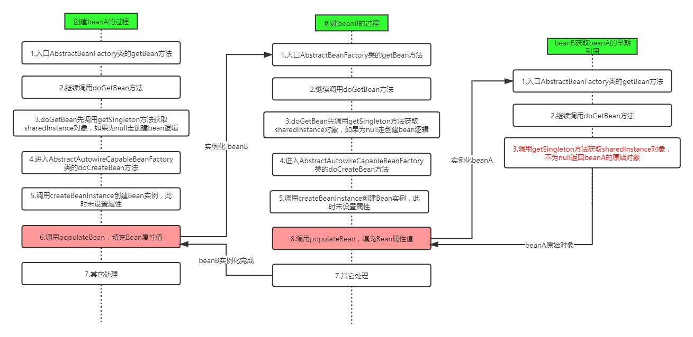

> 每天对自己说一句：早安！

* [一、Spring概述](#一spring概述)
  * [1.Spring简介](#1spring简介)
  * [2.Spring的优势](#2spring的优势)
  * [4.Spring的核心结构](#4spring的核心结构)
* [二、核心思想](#二核心思想)
  * [1.IOC](#1ioc)
  * [2.AOP](#2aop)
* [三、手写实现IOC和AOP](#三手写实现ioc和aop)
  * [1.银行转账案例代码问题分析](#1银行转账案例代码问题分析)
  * [2.问题解决思路](#2问题解决思路)
* [四、Spring IOC应用](#四spring-ioc应用)
  * [1.Spring IOC基础](#1spring-ioc基础)
    * [1.1 BeanFactory与ApplicationContext区别](#11-beanfactory与applicationcontext区别)
    * [1.2 纯xml模式](#12-纯xml模式)
    * [1.3 xml与注解相结合模式](#13-xml与注解相结合模式)
    * [1.4 纯注解模式](#14-纯注解模式)
  * [2.Spring IOC高级特性](#2spring-ioc高级特性)
    * [2.1 lazy-init 延迟加载](#21-lazy-init-延迟加载)
    * [2.2 FactoryBean 和BeanFactory](#22-factorybean-和beanfactory)
    * [2.3 后置处理器](#23-后置处理器)
* [五、Spring IOC源码深度剖析](#五spring-ioc源码深度剖析)
  * [1.Spring IoC容器初始化主体流程](#1spring-ioc容器初始化主体流程)
    * [1.1 Spring IOC的容器体系](#11-spring-ioc的容器体系)
    * [1.2 Bean生命周期关键时机点](#12-bean生命周期关键时机点)
    * [1.3 Spring IOC容器初始化主流程](#13-spring-ioc容器初始化主流程)
  * [2.BeanFactory创建流程](#2beanfactory创建流程)
    * [2.1 获取BeanFactory子流程](#21-获取beanfactory子流程)
    * [2.2 BeanDefinition加载解析及注册子流程](#22-beandefinition加载解析及注册子流程)
  * [3.Bean创建流程](#3bean创建流程)
  * [4.lazy-init延迟加载机制原理](#4lazy-init延迟加载机制原理)
  * [5.Spring IOC循环依赖问题](#5spring-ioc循环依赖问题)
    * [5.1什么是循环依赖](#51什么是循环依赖)
    * [5.2循环依赖处理机制](#52循环依赖处理机制)
* [六、Spring AOP应用](#六spring-aop应用)
  * [1.AOP相关术语](#1aop相关术语)
  * [2.Spring中AOP的代理选择](#2spring中aop的代理选择)
  * [3.Spring中AOP的配置方式](#3spring中aop的配置方式)
  * [4.Spring中AOP的实现](#4spring中aop的实现)
    * [4.1 xml模式](#41-xml模式)
  * [5.Spring声明式事务的支持](#5spring声明式事务的支持)
* [七、Spring AOP源码深度剖析](#七spring-aop源码深度剖析)
  * [1.代理对象创建](#1代理对象创建)
  * [2.Spring声明式事务控制](#2spring声明式事务控制)
    * [2.1 @EnableTransactionManagement](#21-enabletransactionmanagement)
    * [2.2 加载事务控制组件](#22-加载事务控制组件)


# 一、Spring概述

## 1.Spring简介

Spring是分层的全栈轻量级开源框架，以IOC和AOP为内核，提供了Spring MVC和业务层事务管理等众多的企业级应用技术。

## 2.Spring的优势

+ 方便解耦，简化开发

> 通过IOC容器将对象间依赖关系交由Spring控制

+ AOP的支持

> 方便进行面向切面编程

+ 声明式事务的支持

## 4.Spring的核心结构

Spring是一个分层非常清晰并且依赖关系、职责定位非常明确的轻量级框架，主要包括：数据处理模块、Web模块、AOP、Core Container模块和Test模块。

+ Spring核心容器（Core Container）容器是Spring框架最核心的部分，管理者Spring应用中bean的创建、配置和管理。

# 二、核心思想

## 1.IOC

IOC（Inversion of Control）控制反转，是一个技术思想，不是一个技术实现。

**控制反转**：指的是对象创建（实例化、管理）的权利交给外部环境（Spring框架、IOC容器）

> 解决对象之间的耦合问题

**IOC和ID的区别**：

IOC和DI描述的是同一件事情，只是角度不同。

> IOC是站在对象的角度，对象实例化及管理权利交给容器
>
> DI是站在容器的角度，容器把对象依赖的其他对象注入。

## 2.AOP

面向切面编程（解耦，避免代码重复）

> 将横切逻辑代码和业务逻辑代码分离

# 三、手写实现IOC和AOP

## 1.银行转账案例代码问题分析


①问题⼀：在上述案例实现中，service 层实现类在使⽤ dao 层对象时，直接在TransferServiceImpl 中通过 AccountDao accountDao = new JdbcAccountDaoImpl() 获得了 dao层对象，然⽽⼀个 new 关键字却将 TransferServiceImpl 和 dao 层具体的⼀个实现类
JdbcAccountDaoImpl 耦合在了⼀起，如果说技术架构发⽣⼀些变动，dao 层的实现要使⽤其它技术，⽐如 Mybatis，思考切换起来的成本？每⼀个 new 的地⽅都需要修改源代码，重新编译，⾯向接⼝开发的意义将⼤打折扣？

②问题⼆：service 层代码没有竟然还没有进⾏事务控制 ？！如果转账过程中出现异常，将可能导致数据库数据错乱，后果可能会很严重，尤其在⾦融业务。

## 2.问题解决思路

**问题一：**new关键字在实例化对象，可以使用反射技术，将全限定类名配置在xml中；使用工厂通过反射技术生产对象。

**改进：**代码不出现工厂类的字眼；声明一个变量并提供set方法，反射时将所需对象注入。

**问题二：**手动控制JDBC的Connection事务，要将Connection和当前线程绑定，进而控制的是同一个事务。

> jdk动态代理和cglib动态代理，jdk动态代理对象需要实现接口

# 四、Spring IOC应用

## 1.Spring IOC基础

### 1.1 BeanFactory与ApplicationContext区别

BeanFactory是Spring框架中IoC容器的顶层接⼝，它只是⽤来定义⼀些基础功能，定义⼀些基础规范，⽽ApplicationContext是它的⼀个⼦接⼝，⽐BeanFactory要拥有更多的功能，⽐如说国际化⽀持和资源访问（xml，java配置类）等等

**启动IOC容器的方式：**

①Java环境下启动IOC容器

+ ClassPathXmlApplicationContext：从类的根路径下加载配置⽂件（推荐使⽤）
+ FileSystemXmlApplicationContext：从磁盘路径上加载配置⽂件
+ AnnotationConfigApplicationContext：纯注解模式下启动Spring容器

②Web环境下启动IOC容器

+ 从xml启动容器

```xml
<!DOCTYPE web-app PUBLIC
 "-//Sun Microsystems, Inc.//DTD Web Application 2.3//EN"
 "http://java.sun.com/dtd/web-app_2_3.dtd" >

<web-app>
  <display-name>Archetype Created Web Application</display-name>

  <!--配置Spring ioc容器的配置文件-->
  <context-param>
    <param-name>contextConfigLocation</param-name>
    <param-value>classpath:applicationContext.xml</param-value>
  </context-param>
  <!--使用监听器启动Spring的IOC容器-->
  <listener>
    <listener-class>org.springframework.web.context.ContextLoaderListener</listener-class>
  </listener>
</web-app>
```

+ 从配置类启动容器

```xml
<!DOCTYPE web-app PUBLIC
 "-//Sun Microsystems, Inc.//DTD Web Application 2.3//EN"
 "http://java.sun.com/dtd/web-app_2_3.dtd" >

<web-app>
  <display-name>Archetype Created Web Application</display-name>


  <!--告诉ContextloaderListener知道我们使用注解的方式启动ioc容器-->
  <context-param>
    <param-name>contextClass</param-name>
    <param-value>org.springframework.web.context.support.AnnotationConfigWebApplicationContext</param-value>
  </context-param>
  <!--配置启动类的全限定类名-->
  <context-param>
    <param-name>contextConfigLocation</param-name>
    <param-value>com.lagou.edu.SpringConfig</param-value>
  </context-param>
  <!--使用监听器启动Spring的IOC容器-->
  <listener>
    <listener-class>org.springframework.web.context.ContextLoaderListener</listener-class>
  </listener>
</web-app>

```

### 1.2 纯xml模式

**①实例化Bean的三种方式**

1）方式一：使用无参构造函数

在默认情况下，它会通过反射调用无参构造函数创建对象。如果类中没有无参构造函数，将会创建失败。

2）方式二：使用静态方法创建

```xml
<!--使⽤静态⽅法创建对象的配置⽅式-->
<bean id="userService" class="com.lagou.factory.BeanFactory" factory-method="getTransferService"></bean>
```

3）方式三：使用实例化方法创建

工厂类中的方法可能是静态的，也可能是非静态的，当是非静态方法时采用下面配置方式

```xml
<bean id="beanFactory" class="com.lagou.factory.instancemethod.BeanFactory"></bean>
<bean id="transferService" factory-bean="beanFactory" factory-method="getTransferService"></bean>
```

**②Bean的生命周期**

Spring框架管理Bean对象的创建时，Bean对象默认是单例的。

> 在实际开发中用到最多的作用范围就是singleton（单例模式）和prototype（原型模式，也叫多例模式）

```xml
<!--配置service对象-->
<bean id="transferService"
class="com.lagou.service.impl.TransferServiceImpl" scope="singleton">
</bean>
```

### 1.3 xml与注解相结合模式

xml + 注解结合模式，xml文件依然存在，spring IOC容器的启动仍然从加载xml开始

> 一般情况下第三方jar中bean定义在xml，比如数据库连接池。
>
> 自己开发的bean定义使用注解

### 1.4 纯注解模式

改造xml + 注解模式，将xml中遗留内容全部变成注解的形式，从java配置类启动

**对应注解**：

@Configuration 注解，表名当前类是⼀个配置类

@ComponentScan 注解，替代 context:component-scan

@PropertySource，引⼊外部属性配置⽂件

@Import 引⼊其他配置类

@Value 对变量赋值，可以直接赋值，也可以使⽤ ${} 读取资源配置⽂件中的信息

@Bean 将⽅法返回对象加⼊ SpringIOC 容器

## 2.Spring IOC高级特性

### 2.1 lazy-init 延迟加载

Bean的延迟加载（延迟创建）

ApplicationContext容器的默认行为是在启动服务器时将所有singleton bean提前进行实例化。

比如：

```xml
<bean id="testBean" calss="cn.lagou.LazyBean" lazy-init="false" />
```

lazy-init="false"，⽴即加载，表示在spring启动时，⽴刻进⾏实例化。
如果不想让⼀个singleton bean 在 ApplicationContext实现初始化时被提前实例化，那么可以将bean设置为true延迟实例化

### 2.2 FactoryBean 和BeanFactory

BeanFactory接⼝是容器的顶级接⼝，定义了容器的⼀些基础⾏为，负责⽣产和管理Bean的⼀个⼯⼚。

Spring中Bean有两种，⼀种是普通Bean，⼀种是⼯⼚Bean（FactoryBean），FactoryBean可以⽣成
某⼀个类型的Bean实例（返回给我们），也就是说我们可以借助于它⾃定义Bean的创建过程。

Bean创建的三种⽅式中的静态⽅法和实例化⽅法和FactoryBean作⽤类似，FactoryBean使⽤较多，尤其在Spring框架⼀些组件中会使⽤，还有其他框架和Spring框架整合时使⽤

### 2.3 后置处理器

Spring提供了两种后置处理bean的扩展接口，分别为BeanPostProcessor和BeanFactoryProcessor，两者在使用上是有区别的。

**工厂初始化（BeanFactory）->Bean对象**

在BeanFactory初始化之后可以使用BeanFactoryPostProcessor进行后置处理做一些操作。

在Bean对象实例化之后可以使用BeanPostProcessor进行后置处理做一些操作。

**BeanPostProcessor**

BeanPostProcessor是针对Bean级别的处理，可以针对某个具体的Bean。

该接口提供了两个方法postProcessBeforeInitialization和postProcessAfterInitialization，分别在Bean初始化方法前和初始化方法后执行。

>  定义⼀个类实现了BeanPostProcessor，默认是会对整个Spring容器中所有的bean进⾏处理。如果要对具体的某个bean处理，可以通过⽅法参数判断，两个类型参数分别为Object和String，第⼀个参数是每
> 个bean的实例，第⼆个参数是每个bean的name或者id属性的值。所以我们可以通过第⼆个参数，来判断我们将要处理的具体的bean。

注意：处理是发⽣在Spring容器的实例化和依赖注⼊之后。

**BeanFactoryPostProcessor**

> Spring容器启动过程中会将Bean解析成内部的BeanDefinition

BeanFactory级别的处理，是针对整个Bean工厂进行处理。

注意：调⽤ BeanFactoryPostProcessor ⽅法时，这时候bean还没有实例化，此时 bean 刚被解析成BeanDefinition对象

# 五、Spring IOC源码深度剖析

原则：抓主线，关注源码结构和业务流程（淡化具体某行代码的编写细节）

Spring源码构建：

+ 下载源码（github）
+ 安装gradle 5.6.3（类似于maven）
+ 导⼊（耗费⼀定时间）
+ 编译⼯程（顺序：core-oxm-context-beans-aspects-aop）
  ⼯程—>tasks—>compileTestJava

## 1.Spring IoC容器初始化主体流程

> 容器是一组组件和过程的集合

### 1.1 Spring IOC的容器体系

IoC容器是Spring的核⼼模块，是抽象了对象管理、依赖关系管理的框架解决⽅案。

Spring 提供了很多的容器，其中 BeanFactory 是顶层容器（根容器），不能被实例化，它定义了所有 IoC 容器 必须遵从的⼀套原则，具体的容器实现可以增加额外的功能，⽐如我们常⽤到的ApplicationContext，其下更具体的实现如ClassPathXmlApplicationContext 包含了解析 xml 等⼀系列的内容，
AnnotationConfigApplicationContext 则是包含了注解解析等⼀系列的内容。

Spring IoC 容器继承体系⾮常聪明，需要使⽤哪个层次⽤哪个层次即可，不必使⽤功能⼤⽽全的。

### 1.2 Bean生命周期关键时机点

**思路：**创建⼀个类 LagouBean ，让其实现⼏个特殊的接⼝，并分别在接⼝实现的构造器、接⼝⽅法中断点，观察线程调⽤栈，分析出 Bean 对象创建和管理关键点的触发时机。


+ 构造器执行、初始化方法执行、Bean后置处理器的before/after方法：AbstractApplicationContext#refresh#finishBeanFactoryInitialization
+ Bean工厂后置处理器初始化、方法执行：AbstractApplicationContext#refresh#invokeBeanFactoryPostProcessors

* Bean后置处理器初始化：AbstractApplicationContext#refresh#registerBeanPostProcessors

>  Bean对象创建的⼏个关键时机点代码层级的调⽤都在
> AbstractApplicationContext 类 的 refresh ⽅法中，可⻅这个⽅法对于Spring IoC 容器初始化来说相当关键

### 1.3 Spring IOC容器初始化主流程

```java
@Override
	public void refresh() throws BeansException, IllegalStateException {
		synchronized (this.startupShutdownMonitor) {
			// 1.刷新前的预处理
			prepareRefresh();

			// 2.获取BeanFactory：默认实现是DefaultListableBeanFactory，加载BeanDefition并注册到BeanDefitionRegestry
			ConfigurableListableBeanFactory beanFactory = obtainFreshBeanFactory();

			// 3.BeanFactory的预准备工作（BeanFactory进行一些设置，比如context的类加载器等）
			prepareBeanFactory(beanFactory);

			try {
				// 4.BeanFactory准备工作完成后进行的后置处理工作
				postProcessBeanFactory(beanFactory);

				// 5.实例化并调⽤实现了BeanFactoryPostProcessor接⼝的Bean
				invokeBeanFactoryPostProcessors(beanFactory);

				// 6.注册BeanPostProcessor（Bean的后置处理器），在创建bean的前后等执⾏
			registerBeanPostProcessors(beanFactory);

				// 7.初始化MessageSource组件（做国际化功能；消息绑定，消息解析）；
				initMessageSource();

				// 8.初始化事件派发器
				initApplicationEventMulticaster();

				// 9.⼦类重写这个⽅法，在容器刷新的时候可以⾃定义逻辑
				onRefresh();

				// 10.第⼗步：注册应⽤的监听器。就是注册实现了ApplicationListener接⼝的监听器bean
				registerListeners();

				/* 11.初始化所有剩下的⾮懒加载的单例bean
				初始化创建⾮懒加载⽅式的单例Bean实例（未设置属性）
				填充属性
				初始化⽅法调⽤（⽐如调⽤afterPropertiesSet⽅法、init-method⽅法）
				调⽤BeanPostProcessor（后置处理器）对实例bean进⾏后置处
				*/
                finishBeanFactoryInitialization(beanFactory);

				// 12.完成context的刷新。主要是调⽤LifecycleProcessor的onRefresh()⽅法，并且发布事件 （ContextRefreshedEventevent）
				finishRefresh();
			}
            ......
}
```


## 2.BeanFactory创建流程

### 2.1 获取BeanFactory子流程

时序图如下：


### 2.2 BeanDefinition加载解析及注册子流程

**1）该子流程涉及到如下几个关键步骤**

**Resource定位**：指对BeanDefinition的资源定位过程。通俗讲就是找到定义Javabean信息的XML⽂件，并将其封装成Resource对象。

**BeanDefinition载⼊: **把⽤户定义好的Javabean表示为IoC容器内部的数据结构，这个容器内部的数据结构就是BeanDefinition。

**2）过程分析**

时序图：


①⼦流程⼊⼝在 AbstractRefreshableApplicationContext#refreshBeanFactory ⽅法中

②依次调⽤多个类的 loadBeanDefinitions ⽅法  —> AbstractXmlApplicationContext  —>
AbstractBeanDefinitionReader —> XmlBeanDefinitionReader  ⼀直执⾏到XmlBeanDefinitionReader 的 doLoadBeanDefinitions ⽅法

③重点观察XmlBeanDefinitionReader 类的 registerBeanDefinitions ⽅法，期间产⽣了多次重载调⽤

## 3.Bean创建流程

①Bean创建⼦流程⼊⼝在AbstractApplicationContext#refresh()⽅法的finishBeanFactoryInitialization(beanFactory) 处

②进⼊finishBeanFactoryInitialization

③继续进⼊DefaultListableBeanFactory类preInstantiateSingletons⽅法，我们找到下⾯部分的代码，看到⼯⼚Bean或者普通Bean，最终都是通过getBean的⽅法获取实例

④继续跟踪下去，我们进⼊到了AbstractBeanFactory类的doGetBean⽅法，这个⽅法中的代码很多，我们直接找到核⼼部分createBean方法

⑤接着进⼊到AbstractAutowireCapableBeanFactory类的⽅法，找到doCreateBean方法

⑥进⼊doCreateBean⽅法，关注createBeanInstance(创建Bean实例，尚未设置属性)，populateBean方法（Bean属性填充）

## 4.lazy-init延迟加载机制原理

普通 Bean 的初始化是在容器启动初始化阶段执⾏的，⽽被lazy-init=true修饰的 bean 则是在从容器⾥第⼀次进⾏context.getBean() 时进⾏触发。Spring 启动的时候会把所有bean信息(包括XML和注解)解析转化成Spring能够识别的BeanDefinition并存到Hashmap⾥供下⾯的初始化时⽤，然后对每个BeanDefinition 进⾏处理，如果是懒加载的则在容器初始化阶段不处理，其他的则在容器初始化阶段进⾏初始化并依赖注⼊。

## 5.Spring IOC循环依赖问题

### 5.1什么是循环依赖

两个或者两个以上的Bean互相持有对方，形成闭环。

Spring循环依赖的场景有：

+ 构造器的循环依赖（构造器注入）
+ Field属性的循环依赖

其中，构造器的循环依赖问题⽆法解决，只能拋出 BeanCurrentlyInCreationException 异常，在解决属性循环依赖时，spring采⽤的是提前暴露对象的⽅法。

### 5.2循环依赖处理机制

①单例bean构造器参数循环依赖（无法解决）

②prototype原型bean循环依赖（无法解决）

**解决：**

1）**单例bean通过setXxx或者@Autowired进⾏循环依赖**

Spring 的循环依赖的理论依据基于 Java 的引⽤传递，当获得对象的引⽤时，对象的属性是可以延后设置的，但是构造器必须是在获取引⽤之前
Spring通过setXxx或者@Autowired⽅法解决循环依赖其实是通过提前暴露⼀个ObjectFactory对象来完成的，简单来说ClassA在调⽤构造器完成对象初始化之后，在调⽤ClassA的setClassB⽅法之前就把ClassA实例化的对象通过ObjectFactory提前暴露到Spring容器中。

```properties
1.ClassA调⽤setClassB⽅法，Spring⾸先尝试从容器中获取ClassB，此时ClassB不存在Spring
容器中。
2.Spring容器初始化ClassB，同时也会将ClassB提前暴露到Spring容器中
3.ClassB调⽤setClassA⽅法，Spring从容器中获取ClassA ，因为第⼀步中已经提前暴露了ClassA，因此可以获取到ClassA实例
4.ClassA通过spring容器获取到ClassB，完成了对象初始化操作。
5.这样ClassA和ClassB都完成了对象初始化操作，解决了循环依赖问题。
```

# 六、Spring AOP应用

**AOP本质：**在不改变原有业务逻辑的情况下增强横切逻辑，横切逻辑代码往往是权限校验代码、⽇志代码、事务控制代码、性能监控代码。

## 1.AOP相关术语

| 名词                | 解释                                                         |
| ------------------- | ------------------------------------------------------------ |
| Joinpoint（连接点） | 方法开始、结束、运行完毕、异常时这些特殊的时机点称为连接点   |
| Pointcut（切入点）  | 指定AOP思想想要影响的具体方法是那些                          |
| Advice（增强）      | 切面中用于提供增强功能的方法，时机有：前置通知、后置通知、异常通知、最终通知、环绕通知 |
| Target(⽬标对象)    | 被代理对象                                                   |
| Proxy(代理)         | 指的是⼀个类被AOP织⼊增强后，产⽣的代理类。即代理对象        |
| Weaving(织⼊)       | 指的是把增强应⽤到⽬标对象来创建新的代理对象的过程。spring采⽤动态代理织⼊，⽽AspectJ采⽤编译期织⼊和类装载期织⼊。 |
| Aspect(切⾯)        | 切⼊点+增强                                                  |

## 2.Spring中AOP的代理选择

默认情况下，Spring会根据被代理对象是否实现接⼝来选择使⽤JDK还是CGLIB。当被代理对象没有实现任何接⼝时，Spring会选择CGLIB。当被代理对象实现了接⼝，Spring会选择JDK官⽅的代理技术，不过
我们可以通过配置的⽅式，让Spring强制使⽤CGLIB

## 3.Spring中AOP的配置方式

在Spring的AOP配置中，也和IoC配置⼀样，⽀持3类配置⽅式。

+ xml配置
+ xml + 注解组合配置
+ 纯注解配置

## 4.Spring中AOP的实现

需求：横切逻辑代码是打印⽇志，希望把打印⽇志的逻辑织⼊到⽬标⽅法的特定位置(service层transfer⽅法)

### 4.1 xml模式

①引入aop的jar包

②AOP核心配置

```xml
<!--
	Spring基于XML的AOP配置前期准备：
		在spring的配置⽂件中加⼊aop的约束
	xmlns:aop="http://www.springframework.org/schema/aop"
	http://www.springframework.org/schema/aop
	https://www.springframework.org/schema/aop/spring-aop.xsd
	Spring基于XML的AOP配置步骤：
		第⼀步：把通知Bean交给Spring管理
		第⼆步：使⽤aop:config开始aop的配置
		第三步：使⽤aop:aspect配置切⾯
		第四步：使⽤对应的标签配置通知的类型
		⼊⻔案例采⽤前置通知，标签为aop:before
-->
<!--把通知bean交给spring来管理-->
<bean id="logUtil" class="com.lagou.utils.LogUtil"></bean>

<!--开始aop的配置-->
<aop:config>
	<!--配置切⾯-->
	<aop:aspect id="logAdvice" ref="logUtil">
        <!--配置前置通知-->
        <aop:before method="printLog" pointcut="execution(public *
    com.lagou.service.impl.TransferServiceImpl.updateAccountByCardNo(com.lagou
    .pojo.Account))">
        </aop:before>
	</aop:aspect>
</aop:config>
```

> 切点表达式具体写法，不熟悉时可以再搜下

## 5.Spring声明式事务的支持

> 声明式事务要做的就是使⽤Aop（动态代理）来将事务控制逻辑织⼊到业务代码

MySQL的默认隔离级别是：REPEATABLE READ

查询当前使⽤的隔离级别： select @@tx_isolation;

设置MySQL事务的隔离级别： set session transaction isolation level xxx; （设置的是当前mysql连接会话的，并不是永久改变的）

# 七、Spring AOP源码深度剖析

## 1.代理对象创建

容器初始化过程中⽬标Ban已经完成了代理，返回了代理对象

## 2.Spring声明式事务控制

> @EnableTransactionManagement @Transactional

### 2.1 @EnableTransactionManagement

```java
@Target(ElementType.TYPE)
@Retention(RetentionPolicy.RUNTIME)
@Documented
@Import(TransactionManagementConfigurationSelector.class)
public @interface EnableTransactionManagement {
```

### 2.2 加载事务控制组件

**@EnableTransactionManagement 注解**
1)通过@import引⼊TransactionManagementConfigurationSelector类，

它的selectImports⽅法导⼊了另外两个类：AutoProxyRegistrar和ProxyTransactionManagementConfiguration


2）AutoProxyRegistrar类分析
⽅法registerBeanDefinitions中，引⼊了其他类，通过AopConfigUtils.registerAutoProxyCreatorIfNecessary(registry)引⼊
InfrastructureAdvisorAutoProxyCreator，它继承了AbstractAutoProxyCreator，是⼀个后置处理器类


3）ProxyTransactionManagementConfiguration 是⼀个添加了@Configuration注解的配置类（注册bean）

注册事务增强器（注⼊属性解析器、事务拦截器）
属性解析器：AnnotationTransactionAttributeSource，内部持有了⼀个解析器集合Set<TransactionAnnotationParser> annotationParsers;

具体使⽤的是SpringTransactionAnnotationParser解析器，⽤来解析@Transactional的事务属性

事务拦截器：TransactionInterceptor实现了MethodInterceptor接⼝，该通⽤拦截会在产⽣代理对象之前和aop增强合并，最终⼀起影响到代理对象

TransactionInterceptor的invoke⽅法中invokeWithinTransaction会触发原有业务逻辑调⽤（增强事务）

# 八、学习总结

## 1.Spring循环依赖时序图
