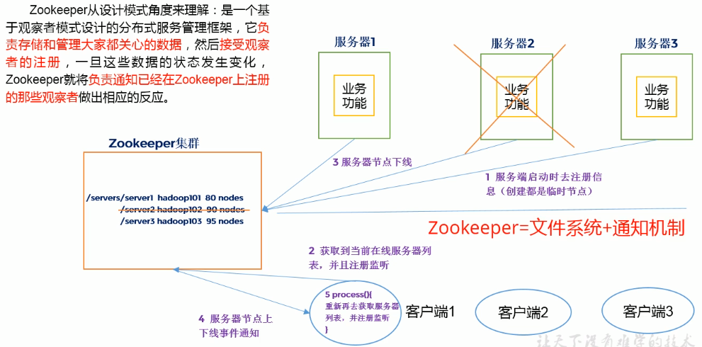

> 每天对自己说一句：早安！

  * [一、Zookeeper入门](#一zookeeper入门)
    * [1.概述](#1概述)
    * [2.工作机制](#2工作机制)
    * [3.Zookeeper特点](#3zookeeper特点)
    * [4.数据结构](#4数据结构)
    * [5.应用场景](#5应用场景)
  * [二、Zookeeper内部原理](#二zookeeper内部原理)
    * [1.节点类型](#1节点类型)
    * [2.选举机制](#2选举机制)
    * [3.写数据流程](#3写数据流程)

> 文章是学习“尚硅谷Zookeeper教程”后所写
## 一、Zookeeper入门
### 1.概述
Zookeeper是一个分布式应用协调服务。

### 2.工作机制
Zookeeper类似于观察者模式。负责存储和管理大家关心的数据，接收观察者的注册。一旦数据状态发生变化，zookeeper就通知在Zzookeeper上注册的那些观察者。

+ 1.服务器启动时去注册信息（创建临时节点）
+ 2.客户端获取当前服务器列表，并注册监听
+ 3.服务器节点下线/上线
+ 4.Zookeeper通知客户端
+ 5.客户端重新获取服务器列表，并注册监听

### 3.Zookeeper特点

  
1）Zookeeper：一个领导者（Leader），多个跟随者（Follower）组成的集群。

2）集群中有半数以上节点存货，Zookeeper集群才能正常服务。

3）全局数据一致

4）更新请求顺序进行

5）**最终一致性**（实时性，在一定时间范围内，Client能读到最新数据）

### 4.数据结构
zookeeper整体上可以看作一棵树，节点称作ZNode，每个ZNode默认能存储1MB数据，具有唯一性。

### 5.应用场景
提供的服务包括：统一命名服务、统一配置管理、统一集群管理、服务节点动态上下线、软负载均衡等。

**1）统一命名服务**

**2）统一配置管理**

**3）统一集群管理**

**4）服务器动态上下线**

客户端能实时洞察服务器上下线变化

**5）软负载均衡**

zookeeper中记录每台服务器的访问数，可以控制让访问数最少的服务器去处理最新的客户端请求。

## 二、Zookeeper内部原理
### 1.节点类型
1）持久化节点

2）持久化顺序节点

3）临时节点

4）临时顺序节点

### 2.选举机制

半数机制，若某服务票数已超半数，直接当选Leader

### 3.写数据流程
1）client向Zookeeper的server1上写数据，发送写请求

2）如果server1不是Leader，会把请求转发leader，Leader会广播给各个server；各server会将写请求加入待写队列，并向Leader发送成功消息。

3）当Leader收到半数以上Server的成功信息，Leader会向各个Server发送提交信息。各server会落实队列里的写请求。

4）Server1通知Client数据写成功了。
